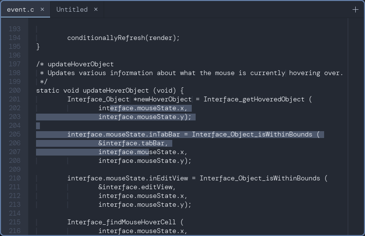

# wyvern

A minimalist graphical text editor built with xlib and cairo.

This is currently in early development. It cannot edit text yet, it can only
display it, and all configuration values are hard-coded.
